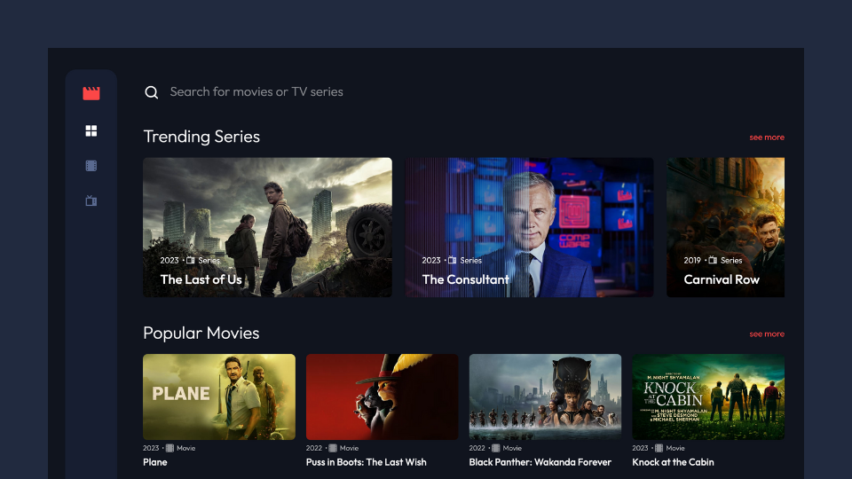

# Reelgood web app

This web app is a resource for discovering new movies and TV shows, and finding where to stream them online.

## Table of contents

- [Overview](#overview)
  - [Previews](#previews)
  - [Links](#links)
  - [Built with](#built-with)
- [My process](#my-process)
  - [Server-side Rendering](#server-side-rendering)
  - [Challenges](#challenges)
  - [Continued Development](#continued-development)
- [Acknowledgements](#acknowledgements)

## Overview

Users should be able to:

- View the optimal layout for the app depending on their device's screen size
- Navigate between Home, Movies, TV Series pages.
- Search for any movie or series on all pages
- Be able to view movies and TV series by genre
- Click to view information for all movies and shows
- Infinitely load in Movies, TV series and Search pages.

### 📸&nbsp;Previews

#### mobile


#### tablet


#### desktop



### 🔗&nbsp;Links

- Solution: [Solution](https://github.com/jkellerman/reelgood)
- Live Site: [Live](https://reelgood.vercel.app/)

### 🧰&nbsp;Built with

- [TypeScript](https://www.typescriptlang.org/)
- [Next.js](https://nextjs.org/)
- [CSS Modules](https://github.com/css-modules/css-modules)
- [TMDB API](https://www.themoviedb.org/?language=en-GB)

## 💭&nbsp;My process

I have designed this app so that users easily discover trending films and TV series available for streaming on popular platforms. After evaluating various APIs, I decided to utilise the TMDB API due to its extensive collection of data points and lack of request limitations.

Originally conceived as a personal project to be completed within a month, I have been continuously improving and deploying the app beyond my initial deadline as I've found it to be a valuable project for enhancing my coding skills, incorporating new techniques and focusing on performance optimisation. As part of my improvements, I have also refactored the entire app to TypeScript and implemented the atomic design methodology to better organise my code. I have gained valuable knowledge throughout the process and have plans to further enhance the app's functionality by adding a back-end at a later date.

### Server-side Rendering

The home page of the app utilises server-side rendering with `stale-while-revalidate` `cache-control headers` in combination with `getServerSideProps`. This ensures that the data for trending movies/series is always fresh while also improving app performance by reducing network requests (see below). Additionally, server-side rendering delivers pre-rendered content to search engines, which improves the app's `search engine optimisation (SEO)` by making the content more accessible and indexable by search engines. Similarly, the individual movie/series pages also utilise server-side rendering as they provide crucial information about the films/series and their availability on streaming platforms.

#### SSR Caching

The Cache-Control header is applied to the API requests for home page data. If a request is repeated within 1 second to 86400 seconds (24 hours), the cached value will be used to fulfill the request, while a revalidation request is made in the background to update the cache with fresh data for future use. Requests repeated after 24 hours will no longer use the stale response and will fetch fresh data.

```js
export const getServerSideProps: GetServerSideProps = async ({ req, res }) => {
  res.setHeader(
    "Cache-Control",
    "public, s-maxage=1, stale-while-revalidate=86400"
  );

  ...
}
```

### Challenges

#### Infinite Scroll

For the interior pages, I implemented an infinite scroll to enable users to easily search through all available movies and series. To accomplish this, I created a custom hook that I used in the movie/series, search, and genre pages. However, I encountered some challenges when implementing the logic. At first, I tried to fetch both the endpoint and the page number in a single useEffect. Unfortunately, this approach didn't work as expected. The endpoint kept being called before the page number, causing duplication issues when switching between genre pages using the dropdown. To fix this problem, I separated the logic for fetching the endpoint and page number into two separate useEffects.

Update:

The useInfiniteScroll custom hook has now been updated to use the `useInfiniteQuery` hook from the [React Query](https://tanstack.com/query/latest) library. The conversion reduces the amount code needed and improves performance by handling data `caching` and background re-fetching. [See custom hook](https://github.com/jkellerman/Reelgood/blob/develop/src/hooks/useInfiniteScroll.ts)

I will also be looking into using the `Intersection Observer` to see if this offers any benefits in performance compared to the scroll listener for this app.

#### Image Optimisation

I encountered some challenges with the Next/Image component and have learned a lot about image optimisation and how it can drastically affect the performance of your app.

One of the benefits of using Next.js is the out-of-box image optimisation when using the Next/Image component. Next.js will optimise your images by automatically converting them to next-gen formats such as WebP which offer better compression and quality than traditional formats like JPEG and PNG, without sacrificing image quality, leading to much smaller file sizes. The Next/Image component also offers on-demand image resizing so the original aspect ratios of images are never served larger than the version that's rendered on the user's screen. Next.js also automatically uses the width and height of images to prevent `Cumulative Layout Shift` which measure your overall layout stability which is important as unexpected shifts in your sites layout can lead to accidental user errors and distraction.

Unfortunately, due to the image optimisation limit on Vercel Hobby accounts I opted out of image optimisation in this app to prevent my account from potentially being suspended, so there are some performance hits in mobile devices as the aspect ratios are larger than they need to be for smaller screens.

However, I made sure to use best practices wherever possible, such as prioritising images with the `largest contentful paint (LCP)` & `lazy loading` images are that not currently in view. The latter makes sure that images are only fetched when they are in view which prevents unnecessary network requests. I also delved into the TMDB API documentation and set up some variables for the image urls so that images are fetched at width sizes that are large enough to maintain the quality of the images but not too large so that I am fetching images in their original sizes. You can find the different image sizes the API offers [here](https://www.themoviedb.org/talk/53c11d4ec3a3684cf4006400).

#### Slider

The homepage design is from [Frontend Mentor](https://www.frontendmentor.io/challenges/entertainment-web-app-J-UhgAW1X) and it featured a trending section that exceeded the viewport width. Initially, I tried to implement a solution using various slider libraries, but they presented some UI issues, so I decided to create my own.

To enhance the user experience, I wanted to allow users to click through the slider instead of relying on horizontal scrolling with a mouse, which can be inconvenient. However, I also wanted to cater to mobile device and Mac trackpad users who might prefer touch-based scrolling. Therefore, I created a hybrid solution that includes both buttons and scrolling capabilities.

Also, clicking the navigation buttons will cause the slider to scroll by the number of cards that are fully visible in the viewport, ensuring consistency and smooth navigation across all screen sizes.

### 👨‍💻&nbsp;Continued development

- Allow users with login credentials to bookmark movies and TV shows.
- Allow users to view streaming platforms based on their geolocation.

## Acknowledgements

- [Entertainment web app challenge on Frontend Mentor](https://www.frontendmentor.io/challenges/entertainment-web-app-J-UhgAW1X) for the homepage and nav design.
- A big shoutout to [Fran](https://github.com/franmsilva) for helping me optimise the API routes. Despite everything working seamlessly, Fran identified and removed some redundant duplication across the directories and introduced me to the Node query-string module, which enabled us to parse and stringify URL query strings in a more concise and efficient manner.
