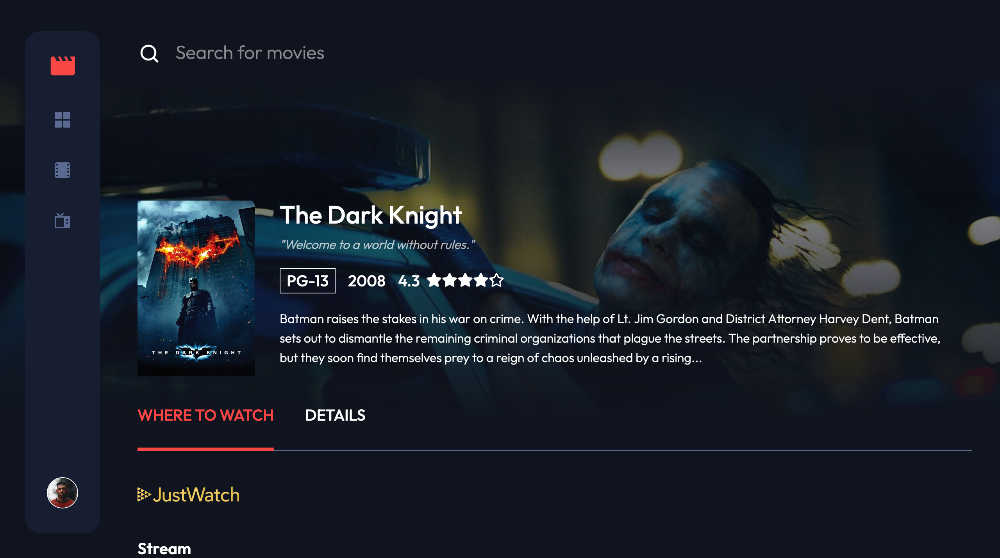
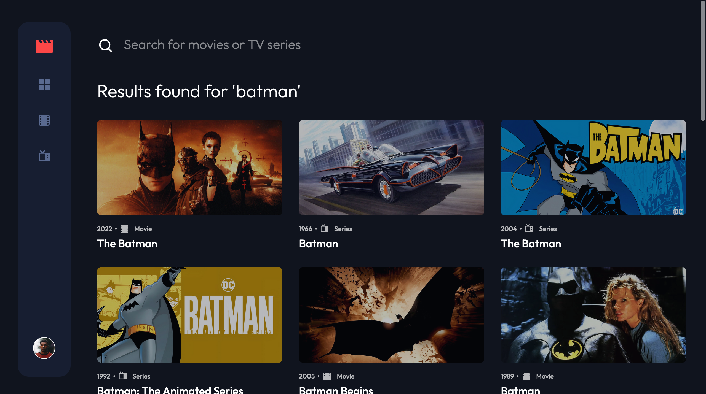
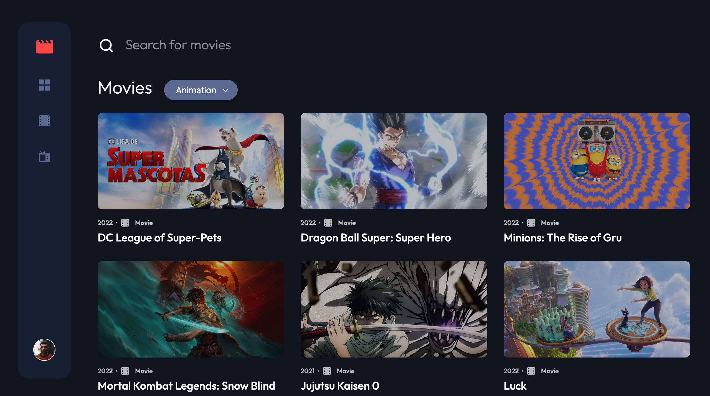
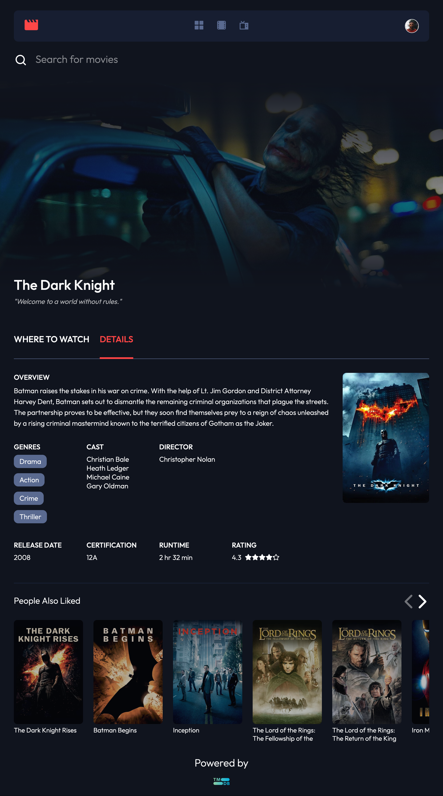
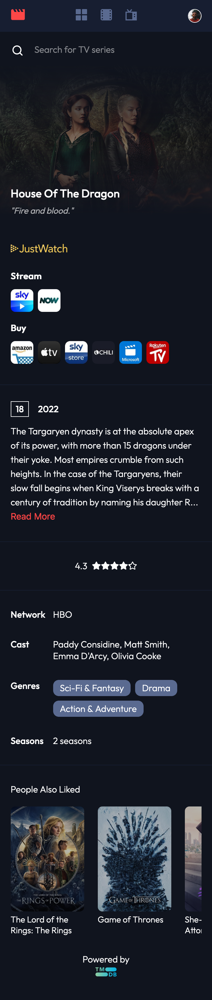

# Entertainment web app

This is my own solution to the [Entertainment web app challenge on Frontend Mentor](https://www.frontendmentor.io/challenges/entertainment-web-app-J-UhgAW1X) with added features. Frontend Mentor challenges help you improve your coding skills by provided professional Figma designs to help you build realistic projects.

## Table of contents

- [Overview](#overview)
  - [The challenge](#the-challenge)
  - [Previews](#previews)
  - [Links](#links)
  - [Built with](#built-with)
- [My process](#my-process)
  - [Added features](#added-features)
  - [Rendering methods](#rendering-methods)
  - [What I learned](#what-i-learned)
  - [Continued development](#continued-development)

## Overview

### The challenge

Users should be able to:

- ✅ View the optimal layout for the app depending on their device's screen size
- ✅ See hover states for all interactive elements on the page
- ✅ Navigate between Home, Movies, TV Series, and Bookmarked Shows pages
- 🚧 Add/Remove bookmarks from all movies and TV series
- ✅ Search for relevant shows on all pages

Some features I added:

- Retrieve movies and TV series data from the TMDB API
- Be able to select movies and TV series by genre
- Click to view information for all movies and shows
- Infinite loading in Movies, TV series and Search pages

### 📸&nbsp;Previews

### 🔗&nbsp;Links

- Solution: [Solution](https://github.com/jkellerman/entertainment)
- Live Site: [Live](https://entertainmentuk.vercel.app/)

### 🧰&nbsp;Built with

- [Next.js](https://nextjs.org/) - React framework
- [CSS Modules](https://github.com/css-modules/css-modules)
- [TMDB](https://www.themoviedb.org/?language=en-GB) - API

## 💭&nbsp;My process

### Added features

The design provided by Frontend Mentor included a small number of films and series in a json file, but I wanted to be able to search any film or series, so I chose to use the TMDB API, which has no request limitations and a wide variety of data points. I found that some of the data points were occasionally inconsistent, which is why a very small amount of films or series will throw a server-side error. This became a bit of a headache, so in order to not spend too long on this, I created a custom 500 page which let's the user know this page is currently unavailable and presents an option to go back to the previous page on the rare chance this occurs. I also decided to let users browse films and shows by genre, as well as get information on any movie or show, including where to stream it, and suggestions for similar movies and shows.

I got the idea for the user to search by genre from Disney+, whose UI has a dropdown menu that allows the client to easily navigate between genre pages. I got the design idea for the movie/series single pages from [Movies.how](https://movies.how/show/rick-and-morty).

### Rendering methods

Now that I'm comfortable with React, I decided to dive into Next.js to learn about some of the framework's out-of-the-box tools, such as their file-system based router and some of the different rendering methods.

This web app is a resource for discovering new movies and TV shows, as well as where to watch them. As this is my first Next.js application, I wanted to experiment with various rendering techniques while also thinking about the techniques that would be most appropriate for this kind of website. Pre-rendering the data would be the greatest solution for a site like this because it isn't sitting behind user authentication and would benefit from SEO to increase organic traffic. The user can click on or search for an infinite number of movies and TV series, hence `server side rendering`—which will render new API Data at request time—is the ideal rendering choice while keeping SEO in mind. I used this method for the individual movie and TV series pages.

The categories on the homepage remain unchanged, and the category data from TMDB is only updated daily. As a result, I determined that using `incremental static regeneration (ISR)` to benefit from fast initial load times while considering SEO would be a good option here. Data will be fetched at build time, and once a user clicks on the homepage, data will be revalidated and fresh data will be rendered in time for subsequent visits. I considered using Next.js's new on-demand ISR, but I couldn't find a way to call the revalidate route without exposing the secret token to the client, so I stuck with ISR. I used client-side rendering for the movie, series, and search pages to allow for smooth transitions between these pages, especially when users switch between genres.

One of the advantages of using NextJS is that CSS modules are included, which I found useful. I prefer scoping styles locally to writing long scss/css files because it is easier to refactor code. I had been using styled components to style my applications recently, but after researching and reading numerous articles such as [this](https://www.puruvj.dev/blog/move-to-css-modules-from-styled-components), because Javascript is more demanding on the main thread, I decided to use CSS in separate files for better performance.

Another advantage is the ability to create API routes with Next.js. Setting up api endpoints on the server allows you to mask the URL of an external service and use server environment variables to prevent unauthorised access to your API keys.

### 💡&nbsp;What I learned

#### No slider library needed 😎

The design included a trending section that overflowed the viewport width but no specific design for scrolling through what's trending. I'd previously created carousels using vanilla JS but was looking for something simple to set up. Regrettably, I had difficulty using multiple libraries for carousels. SwiperJS was causing a problem with no smooth transition on Safari browser, which I couldn't find a solution to. I then used keen-slider, but the problem was that the animation they used, which I believe was something similar to ease or ease-in, was causing the slides to flicker, and there was no option I could find to change the animation.

Despite learning about a variety of slider library options, I ultimately implemented my own. I wanted to allow the user to click through the trending section because horizontal scrolling with a mouse does not provide a good user experience. This isn't an issue for mobile devices or Mac trackpad users, so I wanted a combination of buttons and the ability to scroll with touch. I configured it so that the buttons would only appear on hover. In the past, I've discovered that hover states stick to mobile devices when clicked. I found a solution [here](https://css-tricks.com/solving-sticky-hover-states-with-media-hover-hover/). On mobile devices, no buttons will appear, and users can easily scroll with touch. I also configured the slider so that when buttons are clicked, it scrolls the width of an individual card and its margin-right, which I accomplished by gaining access to the slider DOM node via the **_useRef_** hook and accessing its properties via `.getComputedStyle().getPropertyValue()`.

#### SWR

I discovered the `SWR` hook provided by Next.js, which is a simple way to render client-side data, similar to the React useEffect hook, but with the added benefit of handling caching, revalidation, and refetching on intervals. Before switching to ISR for the homepage, I originally chose **_useSWR_** to fetch data client side but ran into a problem where fetching did not update when switching between genre pages. This is because the images are cached using SWR. The solution would be to implement some of the hook's available options, but in order to save time, I decided to stick to what I know and use the useEffect hook. However, this is something I will definitely look into in the future. I also went with useEffect for infinite loading at the bottom of movie, series, and search pages, but Next.JS also provides another hook called `useSWRInfinite`, which I will investigate further in the future.

#### Image Optimization

Building this app also taught me more about image optimization and how it affects performance. I didn't set any images to 'unoptimised' when I first deployed my application, and discovered that a hobby vercel account has a limit of 1000 optimised images per month. With the sheer number of images in this app, I quickly reached the limit, which meant I had to convert all of my images from webp back to jpeg. In the future, I may simply convert the background image to webp format to optimise LCP (Largest Contentful Paint), because these images take longer to load, especially on larger screens.

There were a few other things I did to improve image performance. I ensured that the images coming from the API were wide enough for the size of their container while still maintaining good quality. If images are retrieved from the API in their original dimensions, the browser will render images with sizes such as 3840 x 2160.

I also made use of the [next/future/image](https://nextjs.org/docs/api-reference/next/future/image) component, which makes use of the native img component to improve performance. However, Next has stated in their documentation that there is a known bug in Safari where the component displays a grey border while loading, and their proposed fix currently does not work. The documentation states that setting images to 'priority' will also resolve the issue, but this isn't an optimal solution for images below the fold, so I resorted to using [next/image](https://nextjs.org/docs/api-reference/next/image) for `lazy loading` for these images.

### 👨‍💻&nbsp;Continued development

- Allow users with login credentials to bookmark movies and TV shows.
- Investigate and comprehend the options provided by the SWR hook.
- Create a loop and autoplay for slider.
- Convert the large background images to 'optimised', so that Next.js converts them from jpeg to webp.
- Allow users to search streaming platforms via geolocation
